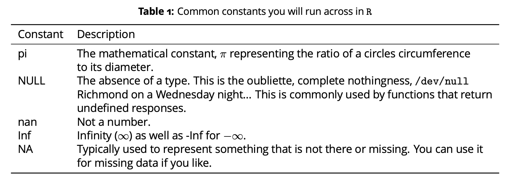

```{r setup, include=FALSE}
knitr::opts_chunk$set(echo = FALSE)
```

```{r, include=FALSE}
options(tinytex.verbose = TRUE)
```

# Biology 395, Advanced Bioassessment | Everything will be in R for your reference!  I will have this presentation, as well as a PDF version you'll be able to take with you.

## Biology 395 {.smaller}

Welcome to Biology 395, Advanced Bioassessment.  In this course we'll:

- Review the basis of Bioassessment (Think conservation biology and genetics)
- Review Run off sources
- Review Water Quality monitoring its uses, and how to gather these data.
- Review Biological Monitoring methods.
- Review the basis of Indices of Biological Integrity
- Gather and analyze VSCI data from a local Appomattox tributary.
- eDNA now and in the future.

## How will this class be formatted? {.smaller}

Mainly, you'll be taking a look at and reviewing my lectures outside of class in Canvas.
Once you review those, you'll come to class and we'll practice what you've looked at in the lectures prior to class.  There will be two exams, one lab report, and lots of small assignments based in R and that will total up your grade.

General outcomes:

- 

## How will this class be formatted? | Continued {.smaller}

Specific outcomes:

- Be able to import and manipulate data in R
- Assess a stream for physical habitat
- Assess a stream for water quality
- Perform Biological Monitoring
- Analyze these data in R
- Discuss the use case(s) of eDNA

## Course Theory

This course is meant to be modeled after how a professional biologist's year.  It will include a field season toward the beginning of the semester and will analyze data once the weather isn't so conducive to acquiring data. 

# August 21 | Preview of Course

## August 21 | Preview of Course  {.smaller}


```{r, echo= TRUE}
library(tidyverse)
library(ggpubr) 
library("FactoMineR")
library("factoextra")

```


## August 21 | Preview of Course

You'll see "chunks" like these throughout the course.  This is actual R code, and is meant to be a guide/reference to you so you can take it with you and use as the basis of your own code in the future.  These HTML slides are what you'll see in class, but I will give you a PDF document of all the code at the end of the semester.  I can also give you particular lectures in PDF format upon your request.

## August 21 | Preview of Course {.smaller}

Today, we're going to take a look at a brief overview of what's in the course starting with conservation biology/genetics.  

```{r, echo=TRUE, out.width= "50%"}

#  
```

## August 21 | Preview of Course {.smaller}

We'll look into the details of run off sources and how they're monitored, mainly in Virginia via the [USGS](https://waterdata.usgs.gov/va/nwis/qw) and [DEQ](https://www.deq.virginia.gov/water/water-quality/monitoring).  
```{r, echo=TRUE, out.width= "50%"}
knitr::include_graphics("Runoff_sources.png")

```

## August 21 | Preview of Course {.smaller}

We'll also talk in a lot of depth about [biological monitoring](https://www.deq.virginia.gov/water/water-quality/monitoring/biological-monitoring).  This is really at the center of the course as this completely relies on our ability to generate indices of biological integrity.  

## August 21 | Preview of Course {.smaller}

Speaking of Indices of Biological Integrity (IBI), we'll talk in depth about how these are generated, and how they're applied.  Indices of biological integrity have been around now for decades.  These include but are not limited to:

- [Shannon Diversity Index](https://www.youtube.com/watch?v=lbnXPI05qNI)
- [Simpson Diversity Index](https://entnemdept.ufl.edu/hodges/protectus/lp_webfolder/9_12_grade/student_handout_1a.pdf)

The links above are really just references for you.  We'll talk in more detail about these later.

## August 21 | Preview of Course {.smaller}

As indices developed, multimetric indices of biological integrity were developed and requested by the EPA so that states could have their own metrics and define what is impaired streams under the 303(d) section of the Clean Water Act.

- Virginia developed it's own IBI known as the Virginia Stream Condition Index [VSCI](https://www.deq.virginia.gov/home/showpublisheddocument/4317/637461491373170000) that we'll discuss in depth.  

- A need was also identified for a multimetric index for streams that are not of a "higher gradient."  Research to develop this index through the mid-2000s produced the Coastal Plain Macroinvertebrate Index [CPMI](https://www.deq.virginia.gov/home/showpublisheddocument/4315/637461491365370000)

We will talk about both of these in detail and learn how to analyze basic VSCI and CPMI datasets in R.

## August 21 | Preview of Course eDNA {.smaller}
eDNA or environmental DNA is a tool used in lieu of doing physical biologial assessment.  It can be used to detect cryptic, invasive, or endangered species without harming them with any sort capture method.  The method isolates DNA from a number of "matrices" namely:
- water
- soil
- bone/excrement
```{r, echo=TRUE, out.width= "50%"}
knitr::include_graphics("edna_image.jpg")

```

## August 21 | Preview of Course eDNA cont'd {.smaller}

Now, eDNA includes things a broad as metagenomics where we isolate DNA from many species in one substrate (mostly commonly, water) to look at what's present in entire ecological communities. 

Good review examples:

- [Willerslev et al 2015](https://www.sciencedirect.com/science/article/pii/S0006320714004443)

- [Willserlev et al 2015 (again)](https://royalsocietypublishing.org/doi/full/10.1098/rstb.2013.0383)

- [Lodge et al 2012](https://onlinelibrary.wiley.com/doi/full/10.1111/j.1365-294X.2012.05600.x)


# August 23 | Phab - Physical habitat assessment

## August 23 | Physical habitat assessment

One of the first assessments necessary when working on a field site for any biomonitoring effort, is to assess physical habitat.  The EPA developed rapid bioassessment tools that include physical habitat monitoring.  

In normal site visits, you would look at each aspect of biomonitoring (Phab, fish, macroinvertebrates, water quality) all at the same time, but since we're learning we're mostly going to take it one at a time, starting with physical habitat.

## August 23 | Physical habitat assessment

Subjectivity is a real issue here.  As each scientist could assess physical habitat differently.  The EPA as a result made a standarized protocol in an effort to decrease variability.
```{r, echo=TRUE, out.width= "50%"}

```

## August 23 | Physical habitat assessment

I also HIGHLY recommend taking a look at at the [Rapid Bioassessment Protocol from the EPA as well](https://www3.epa.gov/region1/npdes/merrimackstation/pdfs/ar/AR-1164.pdf)


## August 23 | Physical habitat assessment

As a result, our aims in this presentation will be three fold:

- Review Physical habitat assessment methods
- Go into field and perform Physical habitat survey on our field site for the semester
- Analyze Physical habitat results from empirical state data.

This lecture is meant to review Physical habitat methods, and next week, we'll go into the field.  When we introduce R, I'll show you how to import data, and then we'll do a brief "analysis."

## August 23 | Physical habitat assessment

There are 10 Physical characteristics of streams we will look at.  Each slide will represent one of the ten aspects, and we'll briefly discuss before going into the field.

-Epifaunal Substrate and Available Cover.
```{r, echo=TRUE, out.width= "50%"}

```

## August 23 | Physical habitat assessment

- Embeddedness
```{r, echo=TRUE, out.width= "50%"}

```

## August 23 | Physical habitat assessment

- Pool Substrate Characterization
```{r, echo=TRUE, out.width= "50%"}

```

## August 23 | Physical habitat assessment

- Velocity Depth Combinations 
```{r, echo=TRUE, out.width= "50%"}
knitr::include_graphics("VelocityDepth.png")
```

## August 23 | Physical habitat assessment

- Pool Variability 
```{r, echo=TRUE, out.width= "50%"}

```

## August 23 | Physical habitat assessment

- Sediment Deposition 
```{r, echo=TRUE, out.width= "50%"}
knitr::include_graphics("Sedimentdeposition.png")
```

## August 23 | Physical habitat assessment

- Channel Flow Status
```{r, echo=TRUE, out.width= "50%"}

```

## August 23 | Physical habitat assessment

- Channel Alteration
```{r, echo=TRUE, out.width= "50%"}

```

## August 23 | Physical habitat assessment

- Frequency of Riffles
```{r, echo=TRUE, out.width= "50%"}

```

## August 23 | Physical habitat assessment

- Channel Sinuosity
```{r, echo=TRUE, out.width= "50%"}

```

## August 23 | Physical habitat assessment

- Bank Stability
```{r, echo=TRUE, out.width= "50%"}

```

## August 23 | Physical habitat assessment

- Bank Vegetatitive Protection
```{r, echo=TRUE, out.width= "50%"}

```

## August 23 | Physical habitat assessment

- Riparian Vegetative Zone Width
```{r, echo=TRUE, out.width= "50%"}
knitr::include_graphics("RiparianBufferZone.png")
```

## August 23 | Physical habitat assessment

The next steps will be actually acquiring these data at our field site (Buffalo Creek - check).  We'll gather the data for the 10 characteristics we discussed and talk about what we think is good and/or bad for QA/QC purposes.

After that, during our R introduction, I will attempt to have you perform a small analysis of Physical habitat data from Virginia DEQ to see if we can look at some basic statistics and perceive something interesting about the data.

# August 30 | Introduction to R

## August 30 | Introduction to R

- R is both a language and an interface for statistical analysis, programming, and graphics. R has become a standard interface for statistical analysis in biological sciences due in part to its openness, ability to be extended by users, and it vibrant user base. As a statistical analysis platform, R has its own grammar and in this activity you will begin to understand how to use and interpret R.

To get R and Rstudio (you'll need both), you can go [here](https://posit.co/download/rstudio-desktop/)

Please have this by next class (Aug 30).  This will be one of your assignments.

## August 30 | Introduction to R {.smaller}

- R itself consists of an underlying engine that takes commands and provides feedback on these commands. Each command you give the R engine is either an:

- Expression 

An expression is a statement that you give the R engine. R will evaluate the expression, give you the answer and not keep any reference to it for future use. Some examples include:
```{r, echo = TRUE}
2 + 6

sqrt(5)

3 * (pi/2) - 1
```

## August 30 | Introduction to R {.smaller}
-Assignment 

An assignment causes R to evaluate the expression and stores the result in a variable. This is important because you can use the variable in the future. An example of an assignment is:

```{r, echo=TRUE}
x <- 2 + 6
myCoolVariable <- sqrt(5)
another_one_number23 <- 3 * (pi/2) - 1
x
myCoolVariable
another_one_number23
```

## August 30 | Introduction to R 
- Functions

There are thousands of potential functions in R and its associated packages. To use these functions, you need to understand the basic taxonomy of a function.
A function has two parts: 
- A unique name, and
- The stuff (e.g., variables) passed to it within the parentheses.

## August 30 | Introduction to R

Not all functions need any additional variables. For example, the function ls() shows which variables R currently has in memory and does not require any parameters.
If you forget to put the parentheses on the function and only use its name, by default R will show you the code that is inside the function (unless it is a compiled function). This is because each function is also a variable. This is why you should not use function names for your variable names (see below for more on naming).

## August 30 | Introduction to R

To find the definition of a function, the arguments passed to it, details of the implementation, and some examples, you can use the ? shortcut. To find the definition for the sqrt() function type ?sqrt and R will provide you the documentation for that function.

## August 30 | Introduction to R {.smaller}

Functions may have more than one parameter passed to it. Often if there are a lot of parameters given then there will be some default values provided. For example, the log() function provides logarithms. The definition of the log function show log(x, base=exp(1)) (say from ?log). Playing around with the function shows:
```{r, echo=TRUE}
log(2)

log(2, base = 2)

log(2, base = 10)
```

## August 30 | Introduction to R

R recognizes over a dozen different types of data. All of the data types are characterized by what R calls classes. To determine the type of any variable you can use the built-in function class(x). This will tell you what kind of variable x is. What follows are some of the more common data types.

## August 30 | Introduction to R {.smaller}

- Numeric

Numeric types represent the majority of numerical valued items you will deal with. When you assign a number to a variable in R it will most likely be a numeric type. Numeric data types can either be displayed with or without decimal places depending if the value(s) include a decimal portion. In fact, R will make any assignment of a numerical value a numeric by default. For example:

## August 30 | Introduction to R {.smaller}
```{r, echo = TRUE}
x <- 4
class(x)
x
x <- numeric(4)
x
```

## August 30 | Introduction to R {.smaller}
```{r, echo=TRUE}
x[1] = 2.4
x
```

## August 30 | Introduction to R {.smaller}

Notice this is an all or nothing deal here, each element of a vector must be the same type and the de- fault value for a numeric data types is zero. Also notice (especially those who have some experience in programming other languages) that dimensions in vectors (and matrices) start at 1 rather than 0.
Operations on numeric types proceed as you would expect but since the numeric type is the default type, you don’t really have to go around using the as.numeric(x) function. For example:

## August 30 | Introduction to R {.smaller}

```{r, echo=TRUE}
is.numeric(2.4)

as.numeric(2) + 0.4

2 + 0.4
```

## August 30 | Introduction to R {.smaller}

- Numeric

Word of Caution, It is important to point out here that you need to be rather careful when dealing with floating point numbers due in part to the way in which computers store these numbers and how they are presented to us in the R interface as well as when we need to perform logical operations on them. Consider the following case. The
ancient Egyptians had an approach to calculating pie as the ratio of 256/81.
```{r, echo=TRUE}
e.pi <- 256/81
e.pi
```

## August 30 | Introduction to R {.smaller}

- Numeric

Word of Caution cont'd:  Very nice and apparently pretty close to 3.1416 so that they could get work done. Now, as we all know, the value of pie is the ratio of a circle’s circumference to its diameter. We also know that it is a transcendeental number (e.g., on that cannot be produced using finite algebraic operations) and its decimal values never repeat.
```{r, echo=TRUE}
print(e.pi, digits = 20)
```

## August 30 | Introduction to R {.smaller}

- Numeric

Word of Caution cont'd: There is another issue that you need to be careful with. You need to be considerate of how a computer stores numerical values. Consider the following:
```{r, echo =TRUE}
x <- 0.3/3
x
print(x, digits = 20)
```

## August 30 | Introduction to R

- Numeric

Why the difference? A computer deals in binary (0/1) representations and as such has a limited ability for precision, particularly for very large or very small numbers. Usually this does not cause much of a problem, but when you begin to work at crafting analyses, you should be aware of this drawback.

## August 30 | Introduction to R {.smaller}

- Character

The character data type is the one that handles letters and letter-like representations of numbers. For example, observe the following:
```{r, echo=TRUE}
x <- "If you can read this, you are beginning to take a step into a larger world."
class(x)
length(x)
```

## August 30 | Introduction to R {.smaller}

- Character

Notice here how the variable x has a length of one, even though there are 37 characters within that string. If you want to know the number of characters, you need to use the nchar() function, otherwise it will tell you the ’vector length’ (see below) of the variable.

```{r, echo=TRUE}
y <- 23
class(y)
z <- as.character(y)
z
class(z)
```

## August 30 | Introduction to R

- Character

Notice how the variable y was initially designated as a numeric type but if we use the as.character(y) function, we can coerce it into a non-numeric representation of the number.
Combining character variables can be done using the paste() function to ’paste together’ a string of char- acters (n.b., notice the optional sep argument).

## August 30 | Introduction to R {.smaller}
```{r, echo=TRUE}
w = "cannot"
x = "I"
y = "can"
z = "code in R"

paste(x, w, z)
paste(x, y, z)
```

## August 30 | Introduction to R

- Constants

Constants are variables that have a particular value associated with them that cannot be changed. They are mostly here for convenience so that we do not have to go look up values for common things. Below are listed some common constants that you will probably encounter as you play with R.

## August 30 | Introduction to R

- Constants

```{r, echo=TRUE, out.width= "50%"}

```

## August 30 | Introduction to R

- Constants

For the non-numerical constants, there are commands such as is.NULL(), is.nan(), is.infinite (and its cousin is.finite()), and is.na() to help you figure out if particular items are of that constant type if you like. At times this can be handy such when you have missing data and you want to set it to some meaningful value (e.g, is.na(X) <- 32 will set all N A values in X to 32). We’ll get into this more in depth at a later time.

## August 30 | Introduction to R {.smaller}

- Logical

Logical data types are boolean variables with a value of TRUE or FALSE. Obviously, these two values are the opposites of each other (e.g., not TRUE is FALSE, etc.). You will encounter logical data types in two primary situations;

- When you are writing a conditional statement that requires you to know the truth about something (e.g., if x == 0 you probably shouldn’t try to divide by x because for some reason mathematicians haven’t figured out how to divide by zero yet...), or

- If you are tying to select some subset of your data by using a particular condition (e.g.,select all entries where color == "blue").

The interesting thing about logical variables is that numbers can be coerced into a logical variable. For example the number zero, as an integer, numeric, complex, or raw data type, is considered to be FALSE whereas any non-zero value is considered TRUE.

## August 30 | Introduction to R

- Factors

Factors are a particular kind of data that is used in statistics associated with treatments. You can think of a factor as a categorical treatment type that you are using in your experiments (e.g., Male vs. Female or Treatment A vs. Treatment B vs. Treatment C). Factors can be ordered or unordered depending upon how you are setting up you experiment.
Most factors are given in as characters so that naming isn’t a problem. Below is an example of five observa- tions where the categorical variable sex of the organism is recorded.

## August 30 | Introduction to R {.smaller}

- Factors

```{r, echo=TRUE}
sex <- factor(c("Male", "Male", "Female", "Female", "Unknown"))
levels(sex)

table(sex)

sex[5] <- "Male"
```

## August 30 | Introduction to R

- Factors

Here the table() function takes the vector of factors and makes a summary table from it. Also notice that the levels() function tells us that there is still an "Unknown" level for the variable even though there is no longer a sample that has been classified as "Unknown" (it just currently has zero of them in the data set).

## August 30 | Introduction to R

- Collections

While alluded to previously, working with single numbers, factors, or local types are OK, but we often work with collections of data and R has some built-in objects that handle different assortments of basic data types.

## August 30 | Introduction to R

A collection of several values, all of the same type, are held in a vector. In fact, all base data types can be created as vectors using the c() function (c for combine).

## August 30 | Introduction to R {.smaller}

-Vectors
```{r, echo=TRUE}
x <- c(1, 2, 3)

y <- c(TRUE, TRUE, FALSE)
y

z <- c("I", "can", "code", "in", "R")
z
```

## August 30 | Introduction to R {.smaller}

To access an element in a vector, R uses square brackets ([]) as demonstrated here:
```{r, echo=TRUE}
x

x[1] <- 2
x[3] <- 1
x

x[2]
```

## August 30 | Introduction to R {.smaller}

Sequences of numbers are so common in analyses that there are several helper functions that assist you.
```{r, echo=TRUE}
x <- 1:6
x

y <- seq(1, 6)
y

z <- seq(1, 20, by = 2)
z

rep(6, 4)
```

## August 30 | Introduction to R

The notion x : y provides a vector of whole numbers from x to y. In a similar fashion the function seq(x,y,by=z) provides a sequence of numbers from x to y but can also have the optional parameter by= to determine how the sequence is made (in this case the by 2s for all the odd numbers from 1 to 20). The function rep(x,y) repeats x a total of y times.

## August 30 | Introduction to R 

- Matrices

Matrices are 2-dimensional vectors and can be created using the default constructor matrix() function. However, since they have 2-dimensions, you must tell R the size of the matrix that you are interested in creating by passing it a number for nrow and ncol for the number of rows and columns.

## August 30 | Introduction to R {.smaller}

- Matrices
```{r, echo=TRUE}
matrix(nrow = 2, ncol = 2)

matrix(23, nrow = 2, ncol = 2)
```

## August 30 | Introduction to R {.smaller}

- Matrices
Matrices can be created from vectors as well.

## August 30 | Introduction to R {.smaller}
```{r, echo=TRUE}
x <- c(1, 2, 3, 4)
x

is.vector(x)

is.matrix(x)

matrix(x)

y <- matrix(x, nrow= 2)

is.matrix(y)

is.vector(y)
```

## August 30 | Introduction to R {.smaller}

There is a slight gotcha here if you are not careful.
```{r, echo=TRUE}
x <- 1:4
matrix(x, nrow = 4, ncol= 2)

matrix(x, nrow = 3)

matrix(seq(1, 8), nrow = 4)
```

## August 30 | Introduction to R {.smaller}

Notice here that R added the values of x to the matrix until it got to the end. However, it did not fill the matrix so it started over again. In the first case the size of x was a multiple of the size of the matrix whereas in the second case it wasn’t but it still assigned the values (and gave a warning). Finally, as shown in the last case, if they are perfect multiples, then it fills up the matrix in a column-wise fashion.
To access values in a matrix you use the square brackets just as was done for the vector types. However, for matrices, you have to use two indices rather than one.

## August 30 | Introduction to R {.smaller}

```{r, echo=TRUE}
X <- matrix(c(1, 2, 3, 4, 5, 6), nrow = 2)
X

X[1, 3]

X[2,2] <- 3.2
X

X[1, ]

X[ , 3]
```

## August 30 | Introduction to R {.smaller}

The last two operations provide a hint as to some of the power associated with manipulating matrices. These are slice operations where only one index is given (e.g., X[1,]) provide a vector as a result for the entire row or column.

## August 30 | Introduction to R {.smaller}

It is at this point that we get into some compounded information.  R no longer just works in the space you were looking at above.  It use to be useful to simply manipulate data in base R as you just saw, but it gets more and more cumbersome as your data complexity intensifies.  

On top of that, R also uses "packages" to work with increasingly complex data to make it more computationally effecient as well as make it easier to look at visually.

## August 30 | Introduction to R {.smaller}

Given that we'll be looking at decently large datasets by the end of the semester, and for your future adventures in R, it will be necessary to get some packages to help with data manipulation as well as visualization.

In our case we'll start with the following:

- [Tidyverse](https://www.tidyverse.org/)
- [ggpubr](https://rpkgs.datanovia.com/ggpubr/)

## August 30 | Introduction to R {.smaller}

I highly encourage you to implement Tidyverse with all your data.  Lists and regular data.frames are kind of a thing of the past.  data.frames in Tidyverse are called "tibbles".  "Tibbles" are essentially data frames with a meta data frame that runs in the background so it is easy for you to call data.  Instead of having to call the specific row or column or call the row or column by $ and the name with the data frame name every time; because of the meta data frame of a tibble, you can just call the variable.  This is super useful with trimming data in various forms (filter, select, mutate, etc.).  

## August 30 | Introduction to R {.smaller}

Ok, so now that we've gone through everything necessary to get started, your assignment coming into class is to get as class to having R and Rstudio installed on your computer.  If you get past that, then load in Tidyverse and ggpubr onto R in Rstudio via the install.packages("") command.

In class we will:
- Make sure you're caught up on your R things from above
- Take a look at some sample data for Phab from VADEQ.
- Take a look at some of our data we just collected as practice. 

## August 30 | Introduction to R {.smaller}

- From above, if you haven't installed R and Rstudio, let's work on that.
- If you haven't gotten tidyverse and ggpubr installed, let's work on that.

## August 30 | Introduction to R {.smaller}

Before getting started, I highly recommend taking a look at the [ggpubr](https://rpkgs.datanovia.com/ggpubr/) website as well as the writer's [blog](http://www.sthda.com/english/articles/24-ggpubr-publication-ready-plots/) for more information and options about how the ggpubr package works.  It's a wrapper package that makes generating publication ready plots a little easier than using just ggplot2 from the tidyverse.

## August 30 | Introduction to R {.smaller}

Once you have that, load in the data I have shared with you that's publicly available 2018 DEQ phab data.

```{r, echo=TRUE}
test <- read_csv("DEQ_2018_Probmondata.csv")

Phab_var <- read_csv("Phab_variables.csv")
# remember you can use variables to call any data frame etc. anything you want, so you don't have to use these variable names I have here but use something that makes sense to you.
```

## August 30 | Introduction to R {.smaller}

Remember that you can use tidyverse to manipulate your data.  See this [tidyverse cheatsheet for reference](https://www.rstudio.com/wp-content/uploads/2015/02/data-wrangling-cheatsheet.pdf).  In our case, we'll need to match the variables to the variables we'll collect in our own Phab dataset (approximately), and then remove any character class variables we shouldn't include so we only look at variables with is.numeric() in class.

```{r, echo=TRUE}
deq_filter <- test %>% select(Phab_var$Variable)

deq_pca <- deq_filter %>% select(-StationID, -Basin, -SubBasin, -BayShed, -EcoRegion)
# filter out character class variables
```

## August 30 | Introduction to R {.smaller}

Remember, there are a lot of ways to pipe variables in tidyverse.  See the cheat sheet.  You don't always have to do one pipe at a time or use just one type of pipe in a single chunk of code.  It will make your code effecient and is the reason why tidyverse in R is so useful.

## August 30 | Introduction to R {.smaller}

In our case, this data is inherently multivariable so, we should reduce the dimesionality of the data to find what about the data drives what we see in the environment and then see what sort of resolution we have within those variables.  This will allow us to see what aspects of physical habitat are "good" versus "bad", and what aspects of the environment are driving the "good" and "bad" qualities.

## August 30 | Introduction to R {.smaller}

If you all want to see the dimensionality reduction now, we can briefly discuss it however, we will talk at more length about these sorts of statistics later in the semester.  I have done the dimensionality reduction for you in this case so we can just look at the resolution of the responsible variables as an exercise for R.

## August 30 | Introduction to R {.smaller}

```{r, echo=TRUE}
fviz_contrib(res.pca, choice = "var", axes = 1, top = 10)
# look at contributing variables to PC1
```

This plot shows the major contributing variables to physical habitat quality.  Next, we'll take a look at the correlation of the data with the habitat scores.

## August 30 | Introduction to R {.smaller}

```{r, echo=TRUE}
cor(deq_filter$PFOR, deq_filter$VSCIVCPMI)
```

## August 30 | Introduction to R {.smaller}

```{r, echo=TRUE}
cor(deq_filter$PAGT, deq_filter$VSCIVCPMI)
```

We can see that our VSCI score is positively correlated with forested cover, and negatively correlated with agricultural cover.  This may be intuitive but why do you think these two aspects of the physical habitat near the watershed effect the overall scores in the way that they do?

## August 30 | Introduction to R {.smaller}

Let's plot the same data to visualize the relationship and play with ggpubr a bit.

```{r, echo=TRUE}
ggscatter(deq_filter, x = "PFOR", y = "VSCIVCPMI")
```

See if you can do this with PAGT as well.

## August 30 | Introduction to R {.smaller}

Let's see if we can add some color by looking at watersheds.

```{r, echo=TRUE}
ggscatter(deq_filter, x = "N_INDEX", y = "VSCIVCPMI", color = "Basin")
```

## August 30 | Introduction to R {.smaller}

Finally, let's return to our two variables of interest, "PFOR" and "PAGT" and see if they have the power to discern reference and impaired streams on their own.  In order to do this, we need to create a new column in our data frame "deq_filter" that shows both reference and impaired streams.  I have done some homework here for you too as we know that the cutoff for VSCI scores is 60.  Let's create that column using tidyverse.  

```{r, echo=TRUE}
deq_filter <- deq_filter %>% mutate(reference = if_else(VSCIVCPMI > 60, "Reference", "Impaired"))
# mutate will create a new column based off all sorts of conditions.  In our case, we need to create a column called reference to determine if a site is a reference condition site based off score or not, and IF so, call it reference ELSE called it impaired.
```

## August 30 | Introduction to R {.smaller}

That's really good practice in applying the logic of R.  Let's take a look and see if when we compare impaired versus reference streams, if we have the statistical power necessary to discern between them using a t.test.

```{r, echo = TRUE}
 p <- ggboxplot(deq_filter, x = "reference", y = "PFOR")
p + stat_compare_means(method = "t.test")
# calling a plot with a variable is nice because then if you add something like stat_comparemeans, you'll keep all the original plot formatting.
```

## August 30 | Introduction to R {.smaller}

See if you can do this for PAGT, and add labels on the axes as well as a title.  Keep practicing!  To get good at R, like anything else, it takes practice.

# September 6 | Conservation Biology/Genetics

## September 6 | Conservation Biology/Genetics

Let's talk about the basis of IBI's!
```{r, echo=TRUE, out.width= "50%"}

```

## September 6 | Conservation Biology/Genetics

Make sure to have read the [linked paper](https://link.springer.com/article/10.1007/s10592-018-1129-9) in Canvas, and have answers to the questions linked in Canvas before class.  We will discuss the paper and the state of conservation genetics/biology in class!

## September 6 | Conservation Biology/Genetics

- Talk about what ESUs are and why they COULD be useful and are debated.

## September 6 | Conservation Biology/Genetics

- What is the lagging indicator of the health of an ESU?

## September 6 | Conservation Biology/Genetics

- What would more immediately show that an ESU may have a threat?

## September 6 | Conservation Biology/Genetics

- What's the real potential current issue with either small or large scale omics datasets in terms of what it can tell us about conservation biology?

## September 6 | Conservation Biology/Genetics

- If an ESU is already at a genetic risk, what sorts of factors may influence whether the ESU is extirpated and/or the species may go extinct?

## September 6 | Conservation Biology/Genetics

- When might it be good to marry gathering ecological and genetic data simultaneously?

## September 6 | Conservation Biology/Genetics

*Discussion points
+ Given the questions above, why do you think we're talking about Conservation Genetics now?
+ What's the big picture in terms of how Conservation Genetics and IBI's interplay?
+ Given our discussion, how do would you approach using an IBI at this point and what bearing would it have on a given species' genetics?

# September 11 | Water quality monitoring

## September 11 | Water quality monitoring

Water quality monitoring is really the backbone of Virginia's assessment of both healthy and impaired lentic and lotic waters in Virginia.  There are many ways in which water quality is included into the overall water quality dataset.  A guide to this can be acquired from Virginia DEQ's website under the [water quality monitoring strategy link](https://www.deq.virginia.gov/water/water-quality/monitoring).

## September 11 | Water quality monitoring

For our purposes, we will really be following the Probmon protocol under the Biological Monitoring (BioMon) program.  Biomonitoring sites include sampling macroinvertebrates in more detail than our SOS protocol we'll be performing, but in essence, we'll be performing the same protocol.  That is, collecting macroinvertebrates via D-frame net, and water quality measures such as temperature, conductivity, pH, and dissolved oxygen.

## September 11 | Water quality monitoring

We'll be using (I hope) a water quality sonde such as a YSI EXO2 multi-parameter sonde that can monitor multiple water quality parameters at once. 
```{r, echo=TRUE, out.width= "50%"}
knitr::include_graphics("YSI_EXO2.png")
```

## September 11 | Water quality monitoring

It is good to place the sonde upstream of our sampling site.

- Can you think of why?

## September 11 | Water quality monitoring

Water quality monitoring, even for biological monitoring sites, is a piece of a much larger puzzle. 

- In 1982, the EPA performed a study of water quality and living resources in the Chesapeake Bay.   This study provided the basis for the future Chesapeake Bay TMDL (Total Maximum Daily Load).
- In 2014, the Chesapeake Watershed Agreement was established which is a multi-state, multi-organization agreement to monitor and decrease nutrients into the Chesapeake Bay.
- Biomonitoring data from Biomon sites' water quality is used as part of these data.

## September 11 | Water quality monitoring

As recently as 2020, Virginia DEQ moved its database to an updated system such that USGS's flow data and DEQ's water quality data could "talk".  This is addition to USGS's [real-time flow and water quality data](https://waterdata.usgs.gov/va/nwis/qw).

## September 11 | Water quality monitoring

Hopefully, I've convinced you of the value of water quality monitoring.  Over the next couple of weeks we'll talk about:

- Sources of run-off
- We'll go through water quality monitoring and Physical habitat protocols.
- We'll go back to our field site and obtain Phab and water quality data.

## September 11 | Water quality monitoring

Now let's build on our previous phab data analysis and see if we can see any relationships between water quality and stream quality.

# Sept 13 | Sources of Run-off

## Sept 13 | Sources of Run-off

```{r, echo=TRUE, out.width= "50%"}
knitr::include_graphics("Runoff_sources.png")
```

## Sept 13 | Sources of Run-off {.smaller}

The [USGS](https://www.usgs.gov/special-topics/water-science-school/science/runoff-surface-and-overland-water-runoff) defines run-off as "That part of the precipitation, snow melt, or irrigation water that appears in uncontrolled (not regulated by a dam upstream) surface streams, rivers, drains or sewers. Runoff may be classified according to speed of appearance after rainfall or melting snow as direct runoff or base runoff, and according to source as surface runoff, storm interflow, or groundwater runoff."

## Sept 13 | Sources of Run-off {.smaller}

 - Meterological effects effecting run-off 
 - Type of precipitation (rain, snow, sleet, etc.)
 - Rainfall intensity
 - Rainfall amount
 - Rainfall duration
 - Distribution of rainfall over the watersheds
 - Direction of storm movement
 - Antecedent precipitation and resulting soil moisture
 - Other meteorological and climatic conditions that affect evapotranspiration, such as temperature, wind, relative humidity, and season.

## Sept 13 | Sources of Run-off {.smaller}

- Physical Characteristics effecting run-off
- Land use
- Vegetation
- Soil type
- Drainage area
- Basin shape
- Elevation
- Slope
- Topography
- Direction of orientation
- Drainage network patterns
- Ponds, lakes, reservoirs, sinks, etc. in the basin, which prevent or alter runoff from continuing downstream

## Sept 13 | Sources of Run-off {.smaller}

Issues within physical characteristics of run-off are extremely important.  Mainly, the land use, and "soil type".  Soil type is in quotes because it can really be broken down into pervious (not penetrable by water) and impervious (penetrable by water) surfaces.  

Pervious surfaces would include:

- soil
- sand
- forest floor
- pervious pavers

Impervious surfaces would include:

- pavement
- brick (with mortar/concrete)
- wood 

## Sept 13 | Sources of Run-off {.smaller}

The way in which run-off flows off these two different surface classes is very important for both water-quality and our stream health.  The faster that water runs off these surfaces, the less time there is for some form of primary production to reduce the concentration of inorganic compounds that can be used by algae and bacteria to eutriphy (that is, remove the oxygen) from a given water source.  The primary inorganic compounds we're referring to here are Nitrogen and Phosphorous.

## Sept 13 | Sources of Run-off {.smaller}

There are two types of run-off:

- Point Source
- Non-point Source

## Sept 13 | Sources of Run-off {.smaller}

If we go back to our image, we can see that both point and non-point sources can contribute nitrogen and phosphorous but, we'll mainly be considering non-point source not only because it comes from a larger area, but it is the largest contributor in Virginia.

```{r, echo=TRUE, out.width= "50%"}
knitr::include_graphics("Runoff_sources.png")
```


## Sept 13 | Sources of Run-off {.smaller}

If you'd like more detail about the definitions of Point versus Non-point source inputs, take a look at pages 450-451 in Ecology by David T. Krohne (can give you copies of the pages upon request).

## Sept 13 | Sources of Run-off {.smaller}

When we look at the current sum of non-point source effects from the [Chesapeake Bay Progress Committee](https://www.chesapeakeprogress.com/clean-water/water-quality), we see the following pictures.

## Sept 13 | Sources of Run-off {.smaller}

```{r, echo=TRUE, out.width= "75%"}

```

## Sept 13 | Sources of Run-off {.smaller}

```{r, echo=TRUE, out.width= "75%"}

```

## Sept 13 | Sources of Run-off {.smaller}

```{r, echo=TRUE, out.width= "75%"}
knitr::include_graphics("Sediment_load.png")
```

## Sept 13 | Sources of Run-off {.smaller}

Sediments are shown last because both phosphorus and nitrogen are really associated with or literally stuck to these sediments.  If we reduce the sediments from non-point sources (aka farms) we can reduce the associated phosphorus and nitrogen.  If we zoom out a bit further to even larger basin, we can really see the effects of nitrogen and phosphorus non-point source run-off.

## Sept 13 | Sources of Run-off {.smaller}

```{r, echo=TRUE, out.width= "12.5%"}

```

This Nitrogen cycling example has a pretty pronounced effect in the Gulf of Mexico that we've been able to monitor now for decades.  At this point there is a hypoxic zone of roughly 5,212 square miles in the Gulf of Mexico, all due to non-point source run-off in the Mississippi watershed.

## Sept 13 | Sources of Run-off {.smaller}

```{r, echo=TRUE, out.width= "50%"}

```

## Sept 13 | Sources of Run-off {.smaller}

If you'd like more information about how this eutriphication has occurred in the Gulf of Mexico, I highly recommend looking at "Coastal Governance" by Richard Burroughs pages 125-129.  I can get you a copy of these pages if you would like.

## Sept 13 | Sources of Run-off {.smaller}

Given our discussion of run-off, what sort of relationship would you expect would occur with Nitrogen and Phosphorous loads in a given watershed with VSCI/CPMI scores?  We will explore this relationship in R in class!

# Sept 25 | Biomonitoring

## Sept 25 | Biomonitoring

The [river continuum concept](https://cfpub.epa.gov/watertrain/moduleFrame.cfm?parent_object_id=671#), is a concept that summarizes the idea of bioaccumulation and uses it to our advantage so we can learn something about the status of water quality in which organisms reside.  

## Sept 25 | Biomonitoring

```{r, echo=TRUE, out.width= "50%"}
knitr::include_graphics("Rivercontinuumconcept.jpeg")
```

## Sept 25 | Biomonitoring

There are many ways to look at the biota to indicate stream health.  Virginia mostly has somewhat smaller order streams especially in the western part of the state.  Can you think of what sort of taxa might be good for "smaller" order streams?

## Sept 25 | Biomonitoring

[Strahler Stream Ordering](https://cfpub.epa.gov/watertrain/moduleFrame.cfm?parent_object_id=657&object_id=660) is a well-known classification based on stream/tributary relationships. The uppermost channels in a drainage network (i.e., headwater channels with no upstream tributaries) are designated as first-order streams down to their first confluence. A second-order stream is formed below the confluence of two first-order channels. Third-order streams are created when two second-order channels join, and so on. Note in the figure that the intersection of a channel with another channel of lower order does not raise the order of the stream below the intersection (e.g., a fourth-order stream intersecting with a second-order stream is still a fourth- order stream below the intersection).

## Sept 25 | Biomonitoring

The Virginia Department of Environmental Quality has a nice guide [here](https://www.deq.virginia.gov/our-programs/water/water-quality/monitoring) that you can downlaod for reference.  In here you will see that, per year, they attempt to sample each stream order, 1-5 in order to approximate the subtle differences in biota present as stream order increases.  This way, on average the variation amongst sites equals out to the average health of the stream in its length and can help define where the sources of potential impairment are flowing in.

## Sept 25 | Biomonitoring

Reasons for BioMon include, but are not limited to:

- ambient monitoring
- probabilistic monitoring
- tracking local pollution events
- TMDL monitoring
- follow-up on waters of concern identified through volunteer citizen monitoring.

## Sept 25 | Biomonitoring

We'll talk more about the specifics of our methods in total soon, as we learn how a full index of biological integrity works but, for biological monitoring sites, we will monitor all of the following:

- temperature
- dissolved oxygen
- pH
- conductivity

This is part of the reason why we've collected phab and water quality data already.

## Sept 25 | Biomonitoring

Now that we have the where and why of biomonitoring, lets' talk about what we're monitoring!

```{r, echo=TRUE, out.width= "50%"}

```

## Sept 25 | Biomonitoring

Biomonitoring really cruxes around the most sensitive native fly larvae.  Ephemeroptera (mayfly), Plecoptera (stonefly), and Tricoptera (Caddisflies) are the crux indicator of stream health in any biomonitoring regime in Virginia.  They fill the niche of breaking down organic material (leaves, mostly) in stream beds with loose, rocky bottoms and provide a source of food for fish in these streams.  EPT richness in one form or another indicates site health and these little larvae are really "living recorders" of water quality history.

## Sept 25 | Biomonitoring

The image below lists the core metrics measured for biomonitoring and form the backbone of the IBI used in Virginia (VSCI).  We'll learn how IBI's and how the VSCI works in the next few lectures.

```{r, echo=TRUE, out.width= "50%"}

```


## Sept 25 | Biomonitoring

Besides the three taxa I mentioned above, the other important taxa to look at are Chironomidae (midges) and hydropsychidae (Caddis flies) as the former represents a tolerant taxa and the latter reflects a non-tolerant taxa that occupies the same niche.  The ratio of the presence of these taxa's presence is important for indicating stream health in the VSCI.

## Sept 25 | Biomonitoring

Now that we have an idea of why we would biomonitor, how it's performed in Virginia, and what taxa are good indicators in the impaired or not impaired direction, let's add to our analysis of physical habitat and water-quality monitoring.

## Sept 25 | Biomonitoring

See the attached script to help you generate the data we need to assess biomonitoring data, and let's try to build on that!

# Sept 27 | Introduction to Indices of Biological Integrity (IBI's)

## Sept 27 | Intro to IBI's

As we talked about in the introduction to the course, Indices of Biological Integrity are really the centerpiece to our ability to assess both habitat and water quality at a given site, and are necessary to assess a stream int he context of the clean water act.

## Sept 27 | Intro to IBI's

To explain this further, we'll go through the history and basics of a couple "canonical" IBI's.

- [Shannon Diversity Index](https://www.youtube.com/watch?v=lbnXPI05qNI)
- [Simpson Diversity Index](https://entnemdept.ufl.edu/hodges/protectus/lp_webfolder/9_12_grade/student_handout_1a.pdf)

## Sept 27 | Intro to IBI's

The necessity of IBI's really begins with a question of diversity and evenness that was noted in principle the first time by one of Darwin's contemporaries, Alfred Russel Wallace.  He noted for the first time that the diversity in the tropics was so astounding that it was difficult to account for what that diversity means.  

## Sept 27 | Intro to IBI's

Evenness is really where we reach the problem of relative diversity or species richness.  Evenness describes the proportion of species present relative to all other species.  This implies that a given area with high evenness could or could not be "good" for diversity in a given area.  You can imagine a place like a desert where there is low evenness and low diversity where that's actual endemically normal.  You can also imagine a scenario like a rain forest that has varying evenness and high diversity and this is also endemically normal.  

## Sept 27 | Intro to IBI's {.smaller}

- Shannon Diversity

This problem above is attempted to be accounted for by the Shannon Diversity index.  The question of abundance and evenness is attempted to be reconciled via normalizing by the proportional species richness.  That is, the number of a given species present divided by the total species present.  It can be articulated as:


H <- -sum(p * ln(p))

p = proportion of number of individuals of a species present


## Sept 27 | Intro to IBI's

This concept was originally used for any uncertainty, so as you can imagine this diversity index is not limited to just ecological concepts. It can be used in the following scenarios but is not limited to those scenarios:

- Information Theory
- Ecological Diversity
- Population Genetic Diversity

## Sept 27 | Intro to IBI's

This is really where the "rubber meets the road" in terms of describing population dynamics that are important to climate change scenarios.  We can initially describe potential diversity abnormalities at the level of the ecology (e.g., biomonitoring) and hypothesize that there would be no effect on population genetic diversity.  

## Sept 27 | Intro to IBI's

- Shannon Diversity

If you watch the YouTube link above, you'll see that Shannon diversity really attempts to measure proportional species richness.  That is, percentages of a given species present out of all species in a given area.  A measure of straight percentages of species present doesn't always represent the true diversity present.

## Sept 27 | Intro to IBI's

Now that we've talked about these basics, can you think of some scenarios that may arise that are an issue related to evenness and abundance that can bias your sample in return?  We will discuss this in class.

## Sept 27 | Intro to IBI's

To study further the issues to the question above, we can look at sample plots of the effect of sampling using the vegan package with the BCI dataset.

```{r, echo = TRUE}
#install dependency
install.packages("vegan")
require(vegan)
data(BCI)
# BCI is a sample dataset containing sampling data from a plant dataset that is embedded in the vegan package
```

## Sept 27 | Intro to IBI's

[This page nicely describes the BCI dataset](https://rdrr.io/cran/vegan/man/BCI.html)

## Sept 27 | Intro to IBI's

There is a function called specaccum in the vegan package that will display accumulation of species present over number of permutations of sites.  Can you plot this, what does this tell you about sampling methods that's important to diversity measures? (Hint: [see this website for a guide](https://search.r-project.org/CRAN/refmans/vegan/html/specaccum.html))

## Sept 27 | Intro to IBI's {.smaller}

Keep the previous idea of sampling bias in mind.  Let's review the Simpson index:

D <- 1/sum(p)^2

- Dominance index
- Not proportional
- Raw species will not effect diversity.

## Sept 27 | Intro to IBI's {.smaller}

Let's talk about a few questions before getting into the R exercise:

- The Shannon index is an information statistic index, which means it assumes all
species are represented in a sample and that they are randomly sampled. Can you point
out any problems in these assumptions? 

- The Simpson index is a dominance index because it gives more weight to
common or dominant species. In this case, a few rare species with only a few
representatives will not affect the diversity. Can you point out any problems in these
assumptions?

## Sept 27 | Intro to IBI's {.smaller}

Ok, so now that we have the data, let's actually organize it, take a look at it, and see if we can learn anything about the diversity of species with these simple IBI's.

```{r, echo = TRUE}
data(BCI.env)
#contains all environmental variables that correspond to the BCI dataset.

simpson <- diversity(BCI, "simpson")
#get Simpson diversity index measures of trees in BCI dataset.

trees <- bind_cols(BCI.env, simpson)
#combine environmental variables with plant/tree data.
```


## Sept 27 | Intro to IBI's {.smaller}

Now that we have the data organized, in class, we'll discuss the questions I posed above, as well as, we'll try to see if we can learn anything from these IBI measures!

# Oct 2 | Review Virginia Stream Condition Index (VSCI)

## Oct 2 | Review VSCI | Introduction

We've now reviewed basic IBI's, but that's not how the application of IBI's work, generally/practically.

Multimetric indices are now widely used in our country to monitor multiple probabilistic sites against reference sites for that condition.

## Oct 2 | Review VSCI | Multimetric Indices

These multimetric indices were implicated after the refreshed EPA methods were established in 1999.  They were further updated by Barbor et al. in 2002.  All of Virginia's monitoring efforts with the Virginia Stream Condition Index (VSCI) are based off these methods.

Prior to the introduction of the VSCI, there was a biomonitoring program with fixed sites that had a single reference.  

## Oct 2 | Review VSCI | Multimetric Indices

Instead of a single metric like richness or evenness as in either a Shannon or Simpson index, an index like the VSCI incorporates multiple measurable metrics (that is, a condition like water quality) into one score that summarizes a streams condition.

We'll talk about those specific metrics later.

## Oct 2 | Review VSCI | Reasons for research {.smaller}

I highly recommend you take a look at the reference PDF for the [VSCI](https://www.deq.virginia.gov/home/showpublisheddocument?id=4317) for a full run down of their research goals in this document but they are as follows:

- Are the existing fixed-site data sufficient to develop biocriteria for Virginia?

- Do the data indicate variability due solely to methods differences between the VDEQ regional offices?

- What is the most appropriate site classification for assessing ecosystem health across Virginia?

- What, if any, are the seasonal differences in biological metrics? Are two index periods required for monitoring?

## Oct 2 | Review VSCI | Reasons for research

- Which metrics are most appropriate for use in a Virginia multimetric macroinvertebrate stream condition index?

- What thresholds indicate the degree of comparability of Virginia streams to reference
condition?

- What improvements can be made to better define the reference condition for ecosystem health of Virginia streams?

## Oct 2 | Review VSCI | Reasons for research

You can think of these as hypotheses which if they find support for or against could mean that they would implement the VSCI (or not).

## Oct 2 | Review VSCI | Definition of a Metric

Metrics are biological attributes that represent elements of the structure and function of the bottom-dwelling macroinvertebrate assemblage.

## Oct 2 | Review VSCI | Definition of a Metric

```{r, echo=TRUE, out.width= "50%"}
knitr::include_graphics("VSCI_coremetrics.png")
```

## Oct 2 | Review VSCI | Definition of a Metric

These core metrics are combined with the following water quality criteria to obtain a score for each field site. 

## Oct 2 | Review VSCI | Definition of a Metric {.smaller}

- Dissolved oxygen >= 6.0 mg/L
- pH between 6.0 and 9.0 (inclusive)
- Conductivity <500 umhos/cm
- Epifaunal substrate score >= 11
- Channel alteration score >= 11
- Sediment deposition score >= 11
- Bank disruptive pressure score >= 11
- Riparian vegetation zone width score >= 6
- Total habitat score >= 120

## Oct 2 | Review VSCI | Other Parameters to consider for the VSCI.

As mentioned above, there are many confounding factors that contribute to whether the VSCI is fit for use across Virginia.  This study for this development was also able to look at variables that are inherently multivariate because we have a multimetric index.  The next slide will explain what those factors are.

## Oct 2 | Review VSCI | Other Parameters to consider for the VSCI. {.smaller}

- Stream order – stream size (as expressed by Strable order) may determine presence or absence of invertebrate species

- Ecoregion and subecoregion – with special emphasis on differences between limestone-influenced streams and non-calcareous streams

- Alkalinity and stream gradient – (or surrogate measures), because many of the physical-chemical differences among ecoregions may be explained as effects of alkalinity or gradient

- Season of sampling, because the VDEQ sampling protocol calls for two index periods, in spring and in fall

- Reference selection criteria – The two sets of selection criteria that were used to select reference sites (Section 3.3): best professional judgment and numeric habitat criteria.

## Oct 2 | Review VSCI | Statistics {.smaller}

Given what that this index is multimetric, that also means it's multivariate.  That lends itself nicely to dimensionality reduction via ordination.  Remember that I mentioned that I would show you more details on these types of statistics when the time comes, and that time has come!  

## Oct 2 | Review VSCI | Statistics {.smaller}

Ordination is most easily explained via regression analysis.  A simple linear regression describes the relationship between two variables.  Any form of ordination aspires to reduce the dimensionality via multiple regressions in the space and project it onto a 2D plane.  

## Oct 2 | Review VSCI | Statistics {.smaller}

Ordination is necessary in order to see which variables (or in our case, metrics) are relevant to the potential impairment or high quality we see in a given field site.  In order for you to be able to visually see how this works, let's take a look at an animation of ordination on the next slide from a Meta employee and professor of Civil Engineering.

## Oct 2 | Review VSCI | Statistics 

[Click here for PCA video example](https://setosa.io/ev/principal-component-analysis/)

## Oct 2 | Review VSCI | Statistics 

Once we reduce the dimensions of the data, we can talk about the statistically relevant metrics to see what role they may play in contributing to the quality of a given site.  See our old code for plotting those metrics below with the PCA code included now.

## Oct 2 | Review VSCI | Statistics 

```{r, echo = TRUE}
test <- read_csv("DEQ_2018_Probmondata.csv")
# read in 2018 probmon data.

Phab_var <- read_csv("Phab_variables.csv")
# variables of interest for us.

deq_filter <- test %>% select(Phab_var$Variable)
# make our deq data match the variables of interest

deq_pca <- deq_filter %>% select(-StationID, -Basin, -SubBasin, -BayShed, -EcoRegion)
# filter out character class variables.  This must be performed in order to perform a PCA.  We cannot cluster on character data

```


## Oct 2 | Review VSCI | Statistics 

```{r, echo = TRUE}
res.pca <- PCA(deq_pca, scale.unit = TRUE, graph = FALSE)
# Perform PCA via "PCA" function.

fviz_pca_ind(res.pca, geom.ind = "point")
# Look at PCA ordination plot
fviz_eig(res.pca, addlabels = TRUE, ylim = c(0, 50))
# Look at percent contribution of each PC.  What do we see?

var <- get_pca_var(res.pca)
# Get variables from PCA

var <- var$contrib
# Assign percent that each eigenvector contributed to each PC in a matrix.

fviz_contrib(res.pca, choice = "var", axes = 1, top = 10)
# Look at which variables contribute most to first PC so we can see if we can get statistical resolution between impaired and reference sites. 
```


## Oct 2 | Review VSCI | Statistics 

Now that we've seen which variables contributed most to the first PC, we're kind of back where we started in the introduction to R lecture.  So in class now, we'll try to:

- Talk about the ins and outs of the VSCI and how it's really supposed to work.

- Each perform this PCA and find the major contributing variables.

- Once we find the contributing variables from the PCA, we'll each try to generate boxplots and statistics for the major contributing variables to the VSCI in the context of the variables relating to Physical Habitat (Phab).

# Oct 4 | Review of our macroinvertabrate collection methods (Save Our Streams, SOS)

