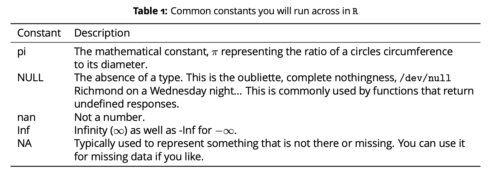

```{r, echo= TRUE}
library(tidyverse)
library(ggpubr) 
library("FactoMineR")
library("factoextra")
#Dependencies.  Please install.packages() if you haven't already.
```

# August 30 | Introduction to R

## August 30 | Introduction to R

- R is both a language and an interface for statistical analysis, programming, and graphics. R has become a standard interface for statistical analysis in biological sciences due in part to its openness, ability to be extended by users, and it vibrant user base. As a statistical analysis platform, R has its own grammar and in this activity you will begin to understand how to use and interpret R.

To get R and Rstudio (you'll need both), you can go [here](https://posit.co/download/rstudio-desktop/)

Please have this by next class (Aug 30).  This will be one of your assignments.

## August 30 | Introduction to R {.smaller}

- R itself consists of an underlying engine that takes commands and provides feedback on these commands. Each command you give the R engine is either an:

- Expression 

An expression is a statement that you give the R engine. R will evaluate the expression, give you the answer and not keep any reference to it for future use. Some examples include:
```{r, echo = TRUE}
2 + 6

sqrt(5)

3 * (pi/2) - 1
```

## August 30 | Introduction to R {.smaller}
-Assignment 

An assignment causes R to evaluate the expression and stores the result in a variable. This is important because you can use the variable in the future. An example of an assignment is:

```{r, echo=TRUE}
x <- 2 + 6
myCoolVariable <- sqrt(5)
another_one_number23 <- 3 * (pi/2) - 1
x
myCoolVariable
another_one_number23
```

## August 30 | Introduction to R 
- Functions

There are thousands of potential functions in R and its associated packages. To use these functions, you need to understand the basic taxonomy of a function.
A function has two parts: 
- A unique name, and
- The stuff (e.g., variables) passed to it within the parentheses.

## August 30 | Introduction to R

Not all functions need any additional variables. For example, the function ls() shows which variables R currently has in memory and does not require any parameters.
If you forget to put the parentheses on the function and only use its name, by default R will show you the code that is inside the function (unless it is a compiled function). This is because each function is also a variable. This is why you should not use function names for your variable names (see below for more on naming).

## August 30 | Introduction to R

To find the definition of a function, the arguments passed to it, details of the implementation, and some examples, you can use the ? shortcut. To find the definition for the sqrt() function type ?sqrt and R will provide you the documentation for that function.

## August 30 | Introduction to R {.smaller}

Functions may have more than one parameter passed to it. Often if there are a lot of parameters given then there will be some default values provided. For example, the log() function provides logarithms. The definition of the log function show log(x, base=exp(1)) (say from ?log). Playing around with the function shows:
```{r, echo=TRUE}
log(2)

log(2, base = 2)

log(2, base = 10)
```

## August 30 | Introduction to R

R recognizes over a dozen different types of data. All of the data types are characterized by what R calls classes. To determine the type of any variable you can use the built-in function class(x). This will tell you what kind of variable x is. What follows are some of the more common data types.

## August 30 | Introduction to R {.smaller}

- Numeric

Numeric types represent the majority of numerical valued items you will deal with. When you assign a number to a variable in R it will most likely be a numeric type. Numeric data types can either be displayed with or without decimal places depending if the value(s) include a decimal portion. In fact, R will make any assignment of a numerical value a numeric by default. For example:

## August 30 | Introduction to R {.smaller}
```{r, echo = TRUE}
x <- 4
class(x)
x
x <- numeric(4)
x
```

## August 30 | Introduction to R {.smaller}
```{r, echo=TRUE}
x[1] = 2.4
x
```

## August 30 | Introduction to R {.smaller}

Notice this is an all or nothing deal here, each element of a vector must be the same type and the de- fault value for a numeric data types is zero. Also notice (especially those who have some experience in programming other languages) that dimensions in vectors (and matrices) start at 1 rather than 0.
Operations on numeric types proceed as you would expect but since the numeric type is the default type, you don’t really have to go around using the as.numeric(x) function. For example:

## August 30 | Introduction to R {.smaller}

```{r, echo=TRUE}
is.numeric(2.4)

as.numeric(2) + 0.4

2 + 0.4
```

## August 30 | Introduction to R {.smaller}

- Numeric

Word of Caution, It is important to point out here that you need to be rather careful when dealing with floating point numbers due in part to the way in which computers store these numbers and how they are presented to us in the R interface as well as when we need to perform logical operations on them. Consider the following case. The
ancient Egyptians had an approach to calculating pie as the ratio of 256/81.
```{r, echo=TRUE}
e.pi <- 256/81
e.pi
```

## August 30 | Introduction to R {.smaller}

- Numeric

Word of Caution cont'd:  Very nice and apparently pretty close to 3.1416 so that they could get work done. Now, as we all know, the value of pie is the ratio of a circle’s circumference to its diameter. We also know that it is a transcendeental number (e.g., on that cannot be produced using finite algebraic operations) and its decimal values never repeat.
```{r, echo=TRUE}
print(e.pi, digits = 20)
```

## August 30 | Introduction to R {.smaller}

- Numeric

Word of Caution cont'd: There is another issue that you need to be careful with. You need to be considerate of how a computer stores numerical values. Consider the following:
```{r, echo =TRUE}
x <- 0.3/3
x
print(x, digits = 20)
```

## August 30 | Introduction to R

- Numeric

Why the difference? A computer deals in binary (0/1) representations and as such has a limited ability for precision, particularly for very large or very small numbers. Usually this does not cause much of a problem, but when you begin to work at crafting analyses, you should be aware of this drawback.

## August 30 | Introduction to R {.smaller}

- Character

The character data type is the one that handles letters and letter-like representations of numbers. For example, observe the following:
```{r, echo=TRUE}
x <- "If you can read this, you are beginning to take a step into a larger world."
class(x)
length(x)
```

## August 30 | Introduction to R {.smaller}

- Character

Notice here how the variable x has a length of one, even though there are 37 characters within that string. If you want to know the number of characters, you need to use the nchar() function, otherwise it will tell you the ’vector length’ (see below) of the variable.

```{r, echo=TRUE}
y <- 23
class(y)
z <- as.character(y)
z
class(z)
```

## August 30 | Introduction to R

- Character

Notice how the variable y was initially designated as a numeric type but if we use the as.character(y) function, we can coerce it into a non-numeric representation of the number.
Combining character variables can be done using the paste() function to ’paste together’ a string of char- acters (n.b., notice the optional sep argument).

## August 30 | Introduction to R {.smaller}
```{r, echo=TRUE}
w = "cannot"
x = "I"
y = "can"
z = "code in R"

paste(x, w, z)
paste(x, y, z)
```

## August 30 | Introduction to R

- Constants

Constants are variables that have a particular value associated with them that cannot be changed. They are mostly here for convenience so that we do not have to go look up values for common things. Below are listed some common constants that you will probably encounter as you play with R.

## August 30 | Introduction to R

- Constants

```{r, echo=TRUE, out.width= "50%"}

```

## August 30 | Introduction to R

- Constants

For the non-numerical constants, there are commands such as is.NULL(), is.nan(), is.infinite (and its cousin is.finite()), and is.na() to help you figure out if particular items are of that constant type if you like. At times this can be handy such when you have missing data and you want to set it to some meaningful value (e.g, is.na(X) <- 32 will set all N A values in X to 32). We’ll get into this more in depth at a later time.

## August 30 | Introduction to R {.smaller}

- Logical

Logical data types are boolean variables with a value of TRUE or FALSE. Obviously, these two values are the opposites of each other (e.g., not TRUE is FALSE, etc.). You will encounter logical data types in two primary situations;

- When you are writing a conditional statement that requires you to know the truth about something (e.g., if x == 0 you probably shouldn’t try to divide by x because for some reason mathematicians haven’t figured out how to divide by zero yet...), or

- If you are tying to select some subset of your data by using a particular condition (e.g.,select all entries where color == "blue").

The interesting thing about logical variables is that numbers can be coerced into a logical variable. For example the number zero, as an integer, numeric, complex, or raw data type, is considered to be FALSE whereas any non-zero value is considered TRUE.

## August 30 | Introduction to R

- Factors

Factors are a particular kind of data that is used in statistics associated with treatments. You can think of a factor as a categorical treatment type that you are using in your experiments (e.g., Male vs. Female or Treatment A vs. Treatment B vs. Treatment C). Factors can be ordered or unordered depending upon how you are setting up you experiment.
Most factors are given in as characters so that naming isn’t a problem. Below is an example of five observa- tions where the categorical variable sex of the organism is recorded.

## August 30 | Introduction to R {.smaller}

- Factors

```{r, echo=TRUE}
sex <- factor(c("Male", "Male", "Female", "Female", "Unknown"))
levels(sex)

table(sex)

sex[5] <- "Male"
```

## August 30 | Introduction to R

- Factors

Here the table() function takes the vector of factors and makes a summary table from it. Also notice that the levels() function tells us that there is still an "Unknown" level for the variable even though there is no longer a sample that has been classified as "Unknown" (it just currently has zero of them in the data set).

## August 30 | Introduction to R

- Collections

While alluded to previously, working with single numbers, factors, or local types are OK, but we often work with collections of data and R has some built-in objects that handle different assortments of basic data types.

## August 30 | Introduction to R

A collection of several values, all of the same type, are held in a vector. In fact, all base data types can be created as vectors using the c() function (c for combine).

## August 30 | Introduction to R {.smaller}

-Vectors
```{r, echo=TRUE}
x <- c(1, 2, 3)

y <- c(TRUE, TRUE, FALSE)
y

z <- c("I", "can", "code", "in", "R")
z
```

## August 30 | Introduction to R {.smaller}

To access an element in a vector, R uses square brackets ([]) as demonstrated here:
```{r, echo=TRUE}
x

x[1] <- 2
x[3] <- 1
x

x[2]
```

## August 30 | Introduction to R {.smaller}

Sequences of numbers are so common in analyses that there are several helper functions that assist you.
```{r, echo=TRUE}
x <- 1:6
x

y <- seq(1, 6)
y

z <- seq(1, 20, by = 2)
z

rep(6, 4)
```

## August 30 | Introduction to R

The notion x : y provides a vector of whole numbers from x to y. In a similar fashion the function seq(x,y,by=z) provides a sequence of numbers from x to y but can also have the optional parameter by= to determine how the sequence is made (in this case the by 2s for all the odd numbers from 1 to 20). The function rep(x,y) repeats x a total of y times.

## August 30 | Introduction to R 

- Matrices

Matrices are 2-dimensional vectors and can be created using the default constructor matrix() function. However, since they have 2-dimensions, you must tell R the size of the matrix that you are interested in creating by passing it a number for nrow and ncol for the number of rows and columns.

## August 30 | Introduction to R {.smaller}

- Matrices
```{r, echo=TRUE}
matrix(nrow = 2, ncol = 2)

matrix(23, nrow = 2, ncol = 2)
```

## August 30 | Introduction to R {.smaller}

- Matrices
Matrices can be created from vectors as well.

## August 30 | Introduction to R {.smaller}
```{r, echo=TRUE}
x <- c(1, 2, 3, 4)
x

is.vector(x)

is.matrix(x)

matrix(x)

y <- matrix(x, nrow= 2)

is.matrix(y)

is.vector(y)
```

## August 30 | Introduction to R {.smaller}

There is a slight gotcha here if you are not careful.
```{r, echo=TRUE}
x <- 1:4
matrix(x, nrow = 4, ncol= 2)

matrix(x, nrow = 3)

matrix(seq(1, 8), nrow = 4)
```

## August 30 | Introduction to R {.smaller}

Notice here that R added the values of x to the matrix until it got to the end. However, it did not fill the matrix so it started over again. In the first case the size of x was a multiple of the size of the matrix whereas in the second case it wasn’t but it still assigned the values (and gave a warning). Finally, as shown in the last case, if they are perfect multiples, then it fills up the matrix in a column-wise fashion.
To access values in a matrix you use the square brackets just as was done for the vector types. However, for matrices, you have to use two indices rather than one.

## August 30 | Introduction to R {.smaller}

```{r, echo=TRUE}
X <- matrix(c(1, 2, 3, 4, 5, 6), nrow = 2)
X

X[1, 3]

X[2,2] <- 3.2
X

X[1, ]

X[ , 3]
```

## August 30 | Introduction to R {.smaller}

The last two operations provide a hint as to some of the power associated with manipulating matrices. These are slice operations where only one index is given (e.g., X[1,]) provide a vector as a result for the entire row or column.

## August 30 | Introduction to R {.smaller}

It is at this point that we get into some compounded information.  R no longer just works in the space you were looking at above.  It use to be useful to simply manipulate data in base R as you just saw, but it gets more and more cumbersome as your data complexity intensifies.  

On top of that, R also uses "packages" to work with increasingly complex data to make it more computationally effecient as well as make it easier to look at visually.

## August 30 | Introduction to R {.smaller}

Given that we'll be looking at decently large datasets by the end of the semester, and for your future adventures in R, it will be necessary to get some packages to help with data manipulation as well as visualization.

In our case we'll start with the following:

- [Tidyverse](https://www.tidyverse.org/)
- [ggpubr](https://rpkgs.datanovia.com/ggpubr/)

## August 30 | Introduction to R {.smaller}

I highly encourage you to implement Tidyverse with all your data.  Lists and regular data.frames are kind of a thing of the past.  data.frames in Tidyverse are called "tibbles".  "Tibbles" are essentially data frames with a meta data frame that runs in the background so it is easy for you to call data.  Instead of having to call the specific row or column or call the row or column by $ and the name with the data frame name every time; because of the meta data frame of a tibble, you can just call the variable.  This is super useful with trimming data in various forms (filter, select, mutate, etc.).  

## August 30 | Introduction to R {.smaller}

Ok, so now that we've gone through everything necessary to get started, your assignment coming into class is to get as class to having R and Rstudio installed on your computer.  If you get past that, then load in Tidyverse and ggpubr onto R in Rstudio via the install.packages("") command.

In class we will:
- Make sure you're caught up on your R things from above
- Take a look at some sample data for Phab from VADEQ.
- Take a look at some of our data we just collected as practice. 

## August 30 | Introduction to R {.smaller}

- From above, if you haven't installed R and Rstudio, let's work on that.
- If you haven't gotten tidyverse and ggpubr installed, let's work on that.

## August 30 | Introduction to R {.smaller}

Before getting started, I highly recommend taking a look at the [ggpubr](https://rpkgs.datanovia.com/ggpubr/) website as well as the writer's [blog](http://www.sthda.com/english/articles/24-ggpubr-publication-ready-plots/) for more information and options about how the ggpubr package works.  It's a wrapper package that makes generating publication ready plots a little easier than using just ggplot2 from the tidyverse.

## August 30 | Introduction to R {.smaller}

Once you have that, load in the data I have shared with you that's publicly available 2018 DEQ phab data.

```{r, echo=TRUE}
test <- read_csv("DEQ_2018_Probmondata.csv")

Phab_var <- read_csv("Phab_variables.csv")
# remember you can use variables to call any data frame etc. anything you want, so you don't have to use these variable names I have here but use something that makes sense to you.
```

## August 30 | Introduction to R {.smaller}

Remember that you can use tidyverse to manipulate your data.  See this [tidyverse cheatsheet for reference](https://www.rstudio.com/wp-content/uploads/2015/02/data-wrangling-cheatsheet.pdf).  In our case, we'll need to match the variables to the variables we'll collect in our own Phab dataset (approximately), and then remove any character class variables we shouldn't include so we only look at variables with is.numeric() in class.

```{r, echo=TRUE}
deq_filter <- test %>% select(Phab_var$Variable)

deq_pca <- deq_filter %>% select(-StationID, -Basin, -SubBasin, -BayShed, -EcoRegion)
# filter out character class variables
```

## August 30 | Introduction to R {.smaller}

Remember, there are a lot of ways to pipe variables in tidyverse.  See the cheat sheet.  You don't always have to do one pipe at a time or use just one type of pipe in a single chunk of code.  It will make your code effecient and is the reason why tidyverse in R is so useful.

## August 30 | Introduction to R {.smaller}

In our case, this data is inherently multivariable so, we should reduce the dimesionality of the data to find what about the data drives what we see in the environment and then see what sort of resolution we have within those variables.  This will allow us to see what aspects of physical habitat are "good" versus "bad", and what aspects of the environment are driving the "good" and "bad" qualities.

## August 30 | Introduction to R {.smaller}

If you all want to see the dimensionality reduction now, we can briefly discuss it however, we will talk at more length about these sorts of statistics later in the semester.  I have done the dimensionality reduction for you in this case so we can just look at the resolution of the responsible variables as an exercise for R.

## August 30 | Introduction to R {.smaller}

```{r, echo=TRUE}
res.pca <- PCA(deq_pca, scale.unit = TRUE, graph = FALSE)
fviz_contrib(res.pca, choice = "var", axes = 1, top = 10)
# look at contributing variables to PC1
```

This plot shows the major contributing variables to physical habitat quality.  Next, we'll take a look at the correlation of the data with the habitat scores.

## August 30 | Introduction to R {.smaller}

```{r, echo=TRUE}
cor(deq_filter$PFOR, deq_filter$VSCIVCPMI)
```

## August 30 | Introduction to R {.smaller}

```{r, echo=TRUE}
cor(deq_filter$PAGT, deq_filter$VSCIVCPMI)
```

We can see that our VSCI score is positively correlated with forested cover, and negatively correlated with agricultural cover.  This may be intuitive but why do you think these two aspects of the physical habitat near the watershed effect the overall scores in the way that they do?

## August 30 | Introduction to R {.smaller}

Let's plot the same data to visualize the relationship and play with ggpubr a bit.

```{r, echo=TRUE}
ggscatter(deq_filter, x = "PFOR", y = "VSCIVCPMI")
```

See if you can do this with PAGT as well.

## August 30 | Introduction to R {.smaller}

Let's see if we can add some color by looking at watersheds.

```{r, echo=TRUE}
ggscatter(deq_filter, x = "N_INDEX", y = "VSCIVCPMI", color = "Basin")
```

## August 30 | Introduction to R {.smaller}

Finally, let's return to our two variables of interest, "PFOR" and "PAGT" and see if they have the power to discern reference and impaired streams on their own.  In order to do this, we need to create a new column in our data frame "deq_filter" that shows both reference and impaired streams.  I have done some homework here for you too as we know that the cutoff for VSCI scores is 60.  Let's create that column using tidyverse.  

```{r, echo=TRUE}
deq_filter <- deq_filter %>% mutate(reference = if_else(VSCIVCPMI > 60, "Reference", "Impaired"))
# mutate will create a new column based off all sorts of conditions.  In our case, we need to create a column called reference to determine if a site is a reference condition site based off score or not, and IF so, call it reference ELSE called it impaired.
```

## August 30 | Introduction to R {.smaller}

That's really good practice in applying the logic of R.  Let's take a look and see if when we compare impaired versus reference streams, if we have the statistical power necessary to discern between them using a t.test.

```{r, echo = TRUE}
 p <- ggboxplot(deq_filter, x = "reference", y = "PFOR")
p + stat_compare_means(method = "t.test")
# calling a plot with a variable is nice because then if you add something like stat_comparemeans, you'll keep all the original plot formatting.
```

## August 30 | Introduction to R {.smaller}

See if you can do this for PAGT, and add labels on the axes as well as a title.  Keep practicing!  To get good at R, like anything else, it takes practice.
